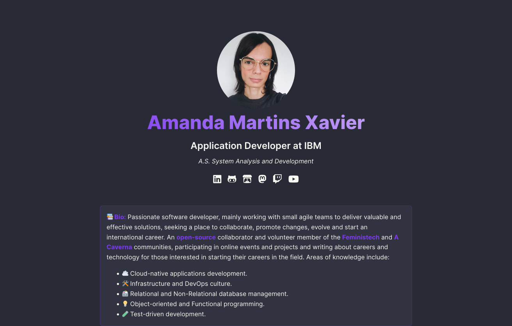

<h1 align="center">✨ amandamartins.dev ✨</h1>

<p align="center">This is my professional portfolio made with <a href="https://nextjs.org" target="_blank">Next.js</a>, and hosted on <a href="https://vercel.com" target="_blank">Vercel</a>.</p>

<p align="center">
  <a href="https://amandamartins.dev>" target="_blank">Production</a>
   • 
  <a href="https://amandamartins.dev>" target="_blank">Preview</a>



## Features 🎉

- SEO 🚧
- Blog 🚧
- Dark mode 🚧
- Responsive design 🚧
- Custom error pages 🚧
- Unit tests with Jest 🚧
- E2E tests with Playwright 🚧
- Linting with ESLint and Prettier ✅

### Pages 📖

- Home page ✅
- Gear page 🚧
- About me page 🚧

## Usage 🔎

- Clone the repository, with the command below:

```console
git clone https://github.com/amandamxavier/amandamartins.dev.git
```

- Install the dependencies:

```console
npm install
```

- Run the project:

```console
npm run dev
```

- ⚠️ Don't forget to run ESLint and Prettier before commit:

```console
npm run lint
```

```console
npm run format
```

## 📋 Issues

Feel free to open an issue if you find a bug or have a suggestion, so we can discuss the best way to improve or fix it.

## 📜 License

This project is made under the MIT license, for more information about its possible use, modification, and sharing, [click here](LICENSE).
